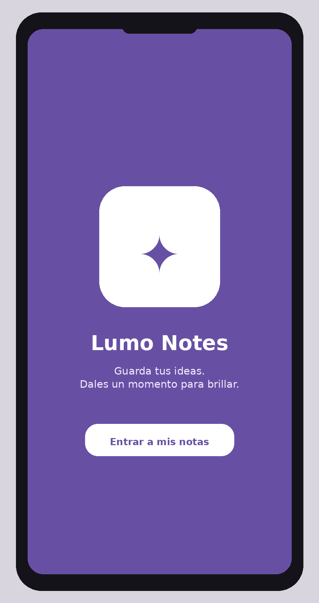
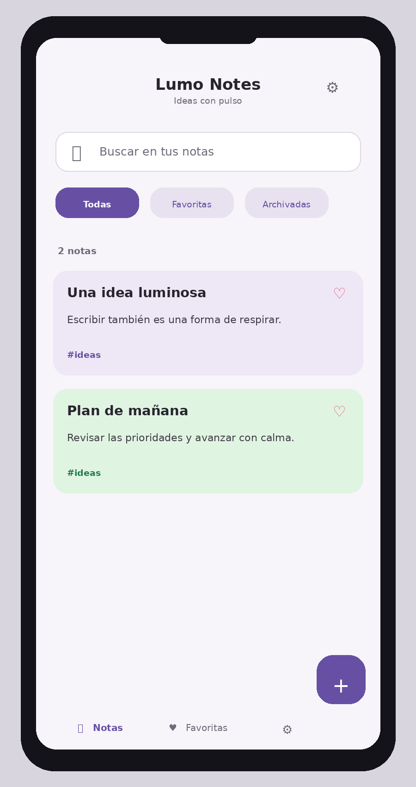
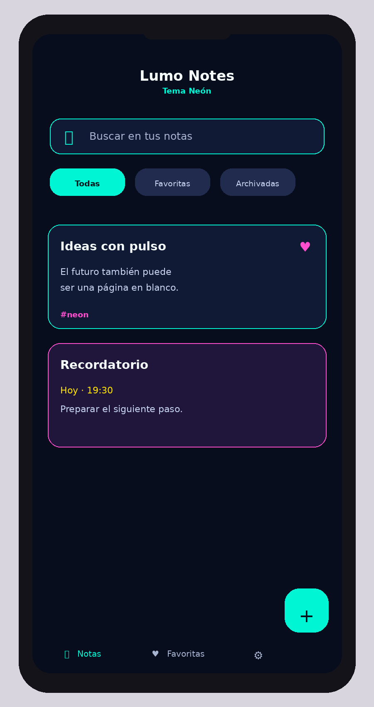
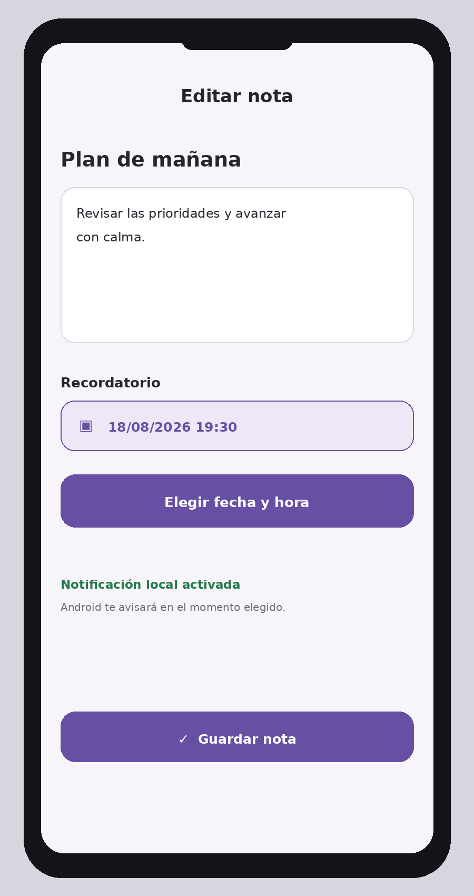

# Lumo Notes

> **Tu espacio privado para capturar ideas, organizar momentos y recordar lo importante.**

[Descargar APK](https://github.com/HUEVOMAN77/lumo-notes/releases/download/v1.0.0/Lumo-Notes.apk) · [Ver la versión publicada](https://github.com/HUEVOMAN77/lumo-notes/releases/tag/v1.0.0)

Lumo Notes es un bloc de notas para Android pensado para escribir rápido, volver a tus ideas cuando lo necesites y mantener tu contenido dentro de tu dispositivo. No necesitas crear una cuenta y no tienes que enviar tus notas a ningún servicio externo.

---

## Qué puedes hacer

| Función | Para qué sirve |
|---|---|
| **Notas rápidas** | Escribe títulos, contenido y etiquetas sin complicaciones. |
| **Búsqueda** | Encuentra una nota por título, texto o etiqueta. |
| **Favoritos** | Marca las ideas que quieres tener siempre a mano. |
| **Archivo** | Aparta notas sin eliminarlas y restáuralas cuando quieras. |
| **Colores** | Dale a cada nota una identidad visual diferente. |
| **Imágenes** | Añade una imagen desde el selector de tu teléfono. |
| **Recordatorios** | Elige un día y una hora para recibir una notificación. |
| **Temas** | Cambia entre Negro, Blanco y Neón. |
| **Privacidad** | Tus notas se guardan localmente en el dispositivo. |

## Descargar e instalar

Descarga el archivo oficial desde **[Lumo Notes v1.0.0](https://github.com/HUEVOMAN77/lumo-notes/releases/download/v1.0.0/Lumo-Notes.apk)**.

Después, abre el archivo APK desde la carpeta de descargas de tu teléfono y sigue las instrucciones de Android. Si el sistema solicita permiso para instalar aplicaciones descargadas fuera de la tienda, autorízalo para el navegador o el gestor de archivos que estés utilizando. Al terminar, abre **Lumo Notes** desde tu pantalla de aplicaciones.

> **Compatibilidad:** Android 7.0 o superior. Para recibir notificaciones, asegúrate de permitirlas cuando Android las solicite.

## Primeros pasos

Al abrir la aplicación verás una breve introducción de bienvenida. Pulsa **“Entrar a mis notas”** o espera a que la pantalla avance automáticamente.

Para crear tu primera nota, pulsa el botón **+**, escribe un título y añade el contenido. También puedes poner una etiqueta, elegir un color y adjuntar una imagen. Cuando termines, pulsa el botón de guardar.

La pantalla principal reúne tus notas y te permite buscar, filtrar y abrir cualquier contenido. Usa la barra inferior para moverte entre **Notas**, **Favoritas**, **Archivo** y **Ajustes**.

## Crear y organizar una nota

1. Pulsa **+** en la pantalla principal.
2. Escribe un título y el contenido de la nota.
3. Añade una etiqueta si quieres encontrarla más fácilmente.
4. Selecciona un color para identificarla visualmente.
5. Pulsa **Guardar**.

Dentro de cada tarjeta puedes marcar una nota como favorita o enviarla al archivo. Para eliminarla, abre la nota y utiliza **Eliminar nota**. La aplicación solicita confirmación antes de borrar el contenido.

## Programar un recordatorio

Los recordatorios son locales y funcionan directamente en tu teléfono.

1. Abre una nota existente o crea una nueva.
2. Pulsa **“Elegir fecha y hora del recordatorio”**.
3. Selecciona el día en el calendario.
4. Selecciona la hora exacta.
5. Guarda la nota.

Android mostrará una notificación en el momento indicado. Si quieres cancelar el aviso, vuelve a abrir la nota y pulsa **“Quitar recordatorio”**. Para que el aviso funcione correctamente, permite las notificaciones de Lumo Notes cuando el sistema las solicite.

## Elegir un tema

Abre **Ajustes** y entra en la sección **Temas**. Puedes elegir entre:

- **Blanco**, claro y limpio para el uso diario.
- **Negro**, sobrio y cómodo para ambientes oscuros.
- **Neón**, expresivo, colorido y de alto contraste.

La selección queda guardada para que la aplicación conserve tu estilo la próxima vez que la abras.

## Privacidad

> Lumo Notes está diseñada para guardar tus notas en el dispositivo. No necesitas una cuenta para utilizarla y el contenido de tus notas no se envía a un servidor.

Las imágenes adjuntas también permanecen dentro del espacio privado de la aplicación. El permiso de notificaciones solo se utiliza para mostrar los recordatorios que tú programes.

## Vista previa

### Bienvenida

### Tema Blanco

### Tema Neón

### Recordatorios

## Preguntas rápidas

**¿Necesito registrarme?** No. Lumo Notes funciona sin cuenta.

**¿Puedo usarla sin conexión?** Sí. Las notas y los recordatorios locales no dependen de una conexión a Internet.

**¿Cómo recupero una nota archivada?** Entra en **Archivo**, abre la nota y pulsa el botón para restaurarla.

**¿Cómo cambio el aspecto de la aplicación?** Ve a **Ajustes → Temas** y selecciona Negro, Blanco o Neón.

**¿Por qué no aparece una notificación?** Revisa que Lumo Notes tenga permiso para mostrar notificaciones y que el recordatorio esté programado para una fecha futura.

## Enlaces

- [Descargar Lumo Notes](https://github.com/HUEVOMAN77/lumo-notes/releases/download/v1.0.0/Lumo-Notes.apk)
- [Consultar la versión v1.0.0](https://github.com/HUEVOMAN77/lumo-notes/releases/tag/v1.0.0)
- [Abrir el repositorio](https://github.com/HUEVOMAN77/lumo-notes)

---

<strong>Lumo Notes</strong> Ideas privadas. Recordatorios oportunos. Más claridad.

